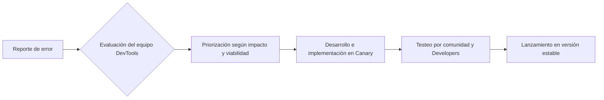

# Mejoras recientes en DevTools

Nuevas funciones diseñadas para facilitar el trabajo de desarrolladores frontend, mejorar el análisis de rendimiento y depuración visual del DOM.

## 🧱 CSS Grid y Subgrid

* **Visualización mejorada en el panel *Layout*:**
   * Líneas de la cuadrícula numeradas, áreas destacadas con nombres y colores.
   * Se puede activar/desactivar desde "Elements > Layout > Grid overlays".
* **Soporte para `subgrid`:**
   * Permite que un contenedor secundario herede la estructura de filas/columnas del grid padre.
   * Visibilidad completa del comportamiento del `subgrid` desde el inspector.

💡 *Beneficio*: Ideal para sistemas de diseño complejos y layouts responsivos más controlados.

## ⚡ Performance Insights (nuevo panel)

Reemplaza gradualmente al panel *Performance* tradicional para análisis más intuitivos.

* **Detección automática de *Layout Thrashing*:**
   * Informa cuando hay múltiples lecturas/escrituras al DOM que afectan el rendimiento.
   * Sugerencias para reordenar lecturas y escrituras en el código.
* **Trazas de rendimiento combinadas:**
   * Combina uso de CPU, GPU, red y eventos en una única línea de tiempo.
   * Mejora la visibilidad de cuellos de botella gráficos o de carga.

📈 *Consejo*: Marca "Enable advanced paint instrumentation" en Experiments para ver detalles más profundos.

## 🖥️ Consola avanzada

* **Nuevos filtros de mensajes:**
   * Filtra logs por tipo: `log`, `warning`, `error`, `info`, `debug`.
   * Añade tags personalizados (ej: `console.log("[API] respuesta recibida")`).
* `console.groupCollapsed()`:
   * Organización más limpia de logs extensos.
   * Muy útil para agrupar procesos por módulo o flujo.

🔍 *Ejemplo*:

```javascript
console.groupCollapsed('Carga de producto');
console.log('ID:', producto.id);
console.log('Precio:', producto.precio);
console.groupEnd();
```

## 🧪 Nuevas APIs disponibles

* **Medición de uso de memoria específico del navegador**:

```javascript
performance.measureUserAgentSpecificMemory()
  .then(result => console.log(result))
  .catch(err => console.error(err));
```

* Retorna un objeto con el uso de memoria RAM por parte de procesos del navegador relacionados con la pestaña activa.

🔧 *Aplicación*: Útil en apps web pesadas como dashboards, editores gráficos o juegos.

## 🔄 Ciclo de vida de mejoras



## 🚀 Tips avanzados

* Activa funcionalidades experimentales desde:
   * `DevTools > Settings > Experiments`
* Algunas funciones útiles para probar:
   * ✅ CSS Grid Debugging v2
   * ✅ Real-time DOM snapshotting
   * ✅ Paint flashing (render updates en vivo)
* Para feedback o propuestas:
   * Usa la opción **"Send Feedback"** integrada o visita el repositorio en GitHub