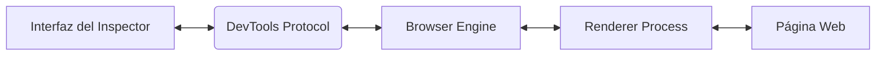

# Cómo interactúa con el navegador

El **Inspector de Elementos** no solo muestra el contenido visual del sitio, sino que está profundamente integrado con la arquitectura del navegador, lo que le permite editar, depurar y analizar el sitio en tiempo real. A continuación se explica cómo funciona esta interacción a nivel interno:

---

### 🔌 **1. DevTools Protocol**

El **DevTools Protocol** es el protocolo de comunicación interno que conecta la interfaz de usuario de las herramientas de desarrollo (DevTools) con los procesos internos del navegador.

- Actúa como un puente entre la **UI del Inspector** y el **motor del navegador** (como Blink en Chrome o Gecko en Firefox).
- Permite ejecutar comandos como:
  - Modificar el DOM.
  - Monitorear eventos de red.
  - Controlar la ejecución de scripts.
  - Acceder a memoria y métricas de rendimiento.

> 🧩 **Ejemplo**: Cuando editas una etiqueta `
` en el panel *Elements*, el protocolo informa al motor del navegador que actualice el DOM.

---

### 🧬 **2. Modelo multiproceso**

Los navegadores modernos operan bajo un modelo multiproceso para mejorar la seguridad, estabilidad y rendimiento:

- Cada **pestaña** tiene un **Renderer Process** dedicado.
- El **Inspector** se comunica con este proceso para reflejar los cambios en el árbol DOM.

**Proceso de comunicación**:

El DOM visible en el panel Elements es una copia sincronizada del DOM real, permitiendo ediciones sin recargar la página.

💡 **Dato curioso**: Puedes inspeccionar múltiples procesos abiertos desde chrome://inspect o ver el uso de memoria desde el Administrador de tareas integrado (Shift + Esc en Chrome).

### 🌐 **3. Acceso a recursos**

El Inspector aprovecha distintas APIs internas del navegador:

- **DOM API**: Lectura y edición de nodos HTML.
- **CSSOM API**: Consulta y modificación dinámica de estilos.
- **Network hooks**: Captura e inspección de solicitudes HTTP/HTTPS.
- **JS Runtime hooks**: Acceso al entorno de ejecución de JavaScript.

**Ejemplos prácticos**:
- Ver y editar propiedades de CSS desde el panel Styles.
- Interceptar y modificar respuestas de red en el panel Network.
- Pausar scripts y examinar el estado del stack de ejecución en Sources.

### 🧰 **Herramientas de depuración remota**

Puedes conectar el Inspector a dispositivos móviles, emuladores o aplicaciones web externas usando:

- chrome://inspect en Chrome.
- about:debugging en Firefox.
- El modo remoto de Safari para iOS.

Esto es ideal para:
- Depurar Progressive Web Apps (PWAs).
- Ver cómo un sitio se comporta en navegadores embebidos o WebViews.
- Optimizar la experiencia en móviles reales.

🔧 **Tip**: Puedes habilitar la depuración remota ejecutando Chrome con el flag `--remote-debugging-port=9222`.

### ✅ **Resumen**

| Componente | Función clave |
|------------|---------------|
| DevTools Protocol | Comunicación entre interfaz y motor del navegador |
| Renderer Process | Ejecuta código del sitio en pestañas independientes |
| DOM/CSSOM APIs | Permite lectura y edición del contenido visual |
| Network/JS Hooks | Intercepta llamadas de red y ejecución de scripts |
| Herramientas remotas | Facilita la depuración de dispositivos externos |

🚀 **Pro tip**: El poder del Inspector no solo está en ver, sino en intervenir directamente en la ejecución del navegador en tiempo real.