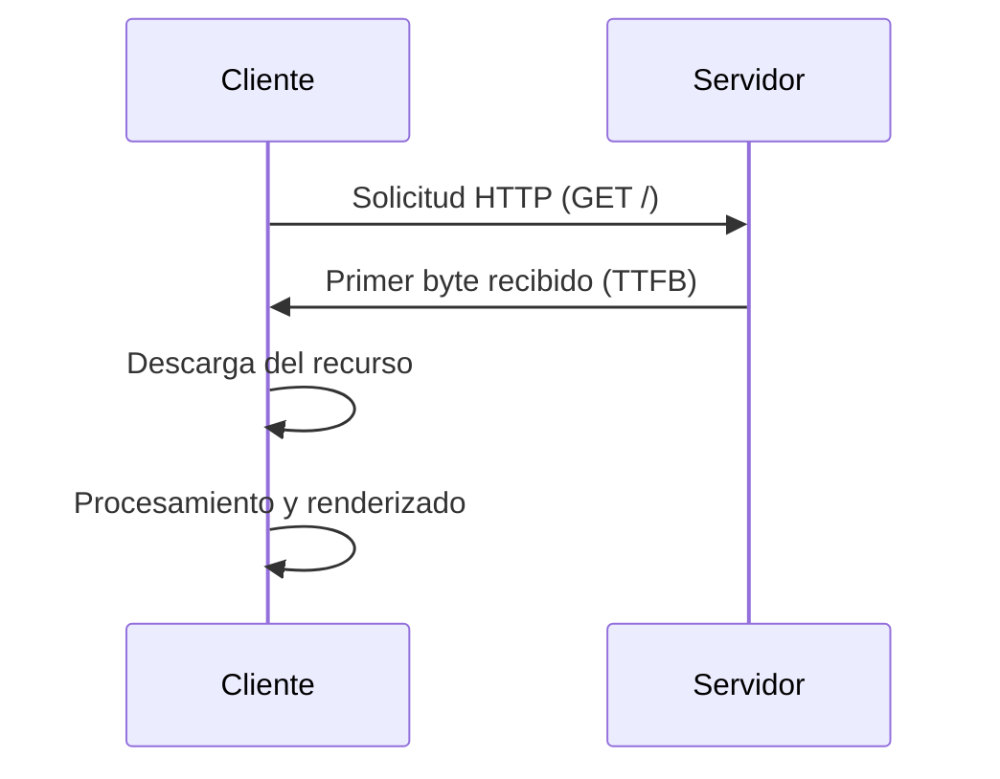

# Analizar tiempos de carga

Entender y optimizar los tiempos de carga es fundamental para mejorar la experiencia del usuario, el posicionamiento SEO y la conversión. A continuación, se detallan las métricas y herramientas clave para evaluar el rendimiento de tu sitio web desde DevTools.

---

## 📈 Métricas esenciales de rendimiento

| Métrica                         | Qué mide                                                            | Valor ideal  | Cómo mejorar                                       |
|---------------------------------|----------------------------------------------------------------------|--------------|----------------------------------------------------|
| **TTFB** (Time to First Byte)   | Tiempo entre la solicitud y el primer byte recibido del servidor     | < 200 ms     | Optimizar backend, bases de datos y caching        |
| **Content Download**            | Tiempo total para descargar el recurso completo                      | Depende del tamaño | Usar compresión (Gzip, Brotli), reducir peso         |
| **First Paint / FCP**           | Momento en que se muestra el primer píxel                           | < 1 seg      | Minimizar JS/CSS bloqueantes                      |
| **DOMContentLoaded**            | Cuando se carga y parsea el HTML                                    | < 1.5 seg    | Aplazar scripts no críticos                        |

---

## 🧪 Inspección con `performance.getEntriesByType('navigation')`

Desde la consola:

```js
performance.getEntriesByType('navigation')[0];
```

Esto devuelve un objeto con tiempos precisos, como:

- `domContentLoadedEventStart`
- `responseStart` (TTFB)
- `responseEnd` (fin de descarga)
- `loadEventEnd`

---

## 📊 **TTFB: Time to First Byte**

- **¿Qué es?** Tiempo desde que se hace la solicitud hasta que el navegador recibe el primer byte.
- **¿Qué afecta?** Lógica del servidor, tiempo de procesamiento de la base de datos, velocidad de red.

**Cómo visualizarlo:**  
Utiliza el panel **Network** → columna **Waterfall** → primer bloque de cada recurso.

**🛠 Mejora con:**

- Redis/Memcached para acelerar respuestas.
- Servidores más rápidos (Nginx, HTTP/2).
- Políticas de cacheo (Cache-Control, ETag).

---

## ⬇️ **Content Download**

- **¿Qué es?** Tiempo en el que se descarga el contenido una vez iniciado.

**Factores que influyen:**

- Tamaño del recurso (imágenes pesadas, scripts grandes).
- Ancho de banda del usuario.

**🛠 Mejora con:**

- Comprimir assets: Brotli o Gzip.
- Servir imágenes optimizadas (.webp, lazy-loading).
- Servir recursos desde un CDN cercano al usuario.

---

## 🧱 **Waterfall Chart**

El gráfico de cascada del panel **Network** muestra el orden, duración y bloqueo entre solicitudes, permitiendo detectar:

- Solicitudes secuenciales innecesarias.
- Recursos bloqueantes (JS/CSS que retrasan el render).
- Problemas de paralelismo en la carga.

**📌 Mejora con:**

```html
<!-- Prioriza carga temprana -->
<link rel="preload" href="/estilos.css" as="style">
<link rel="preconnect" href="https://fonts.googleapis.com">
```

---

## 🧬 **Diagrama de secuencia: carga típica**



---

## 💾 **Exportar datos para análisis**

Puedes guardar los datos de carga en un archivo .HAR (HTTP Archive):

- Haz clic derecho en cualquier parte del panel **Network**.
- Selecciona **Save all as HAR with content**.
- Analízalo en Google HAR Analyzer o compártelo con tu equipo.

---

## ⚡ **Bonus: mediciones avanzadas desde consola**

```js
// Obtener solo TTFB de la navegación actual:
performance.getEntriesByType("navigation")[0].responseStart - performance.getEntriesByType("navigation")[0].startTime;
```

```js
// Mostrar todas las fases de carga:
console.table(performance.getEntriesByType('navigation')[0]);
```

---

## 📌 Resumen de mejoras clave

| Problema             | Solución                                               |
|----------------------|--------------------------------------------------------|
| TTFB alto            | Optimiza backend, reduce lógica de servidor            |
| Descarga lenta       | Usa compresión, minifica, distribuye desde CDN           |
| Recursos bloqueantes | Usa preload, async, defer en scripts                   |
| Carga secuencial     | Paraleliza mediante preconnect, dns-prefetch             |

---

## 📍 Tip final

Activa la pestaña **Performance** y graba una interacción completa para observar en detalle cuándo ocurre cada fase de carga (FCP, LCP, Paint, etc.).