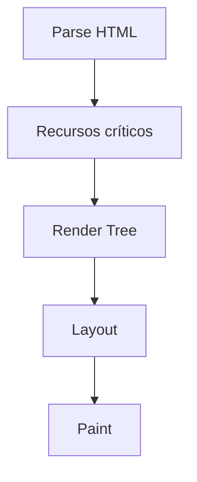

# Performance: Optimización de carga

Mejorar la velocidad de carga y la fluidez de una página web es esencial para la experiencia del usuario. El panel **Performance** de DevTools permite grabar, analizar y optimizar el comportamiento de una aplicación bajo interacción real.

---

### 🎬 1. **Grabación de rendimiento**

La grabación es el punto de partida para cualquier análisis:

- Haz clic en el botón de grabación ⏺️ (o presiona `Ctrl + E` / `Cmd + E`).
- Realiza interacciones críticas:
  - Desplazamientos (*scroll*).
  - Clics y navegación.
  - Animaciones o cambios dinámicos.
- Detén la grabación para analizar los resultados.

> 💡 Consejo: Usa la opción **"Screenshots"** para capturar los fotogramas durante la grabación.

---

### 📈 2. **Análisis del timeline (línea de tiempo)**

Una vez grabado el comportamiento:

- El timeline se divide en **fases clave**:
  - **Loading**: Descarga de recursos y parseo del DOM.
  - **Scripting**: Ejecución de JavaScript.
  - **Rendering**: Cálculo de estilos, layout y pintura.
  - **Painting & Compositing**: Dibujo final en pantalla.

- **Identifica Long Tasks**:
  - Se resaltan en rojo.
  - Son tareas que **bloquean el hilo principal por más de 50ms**.
  - Revisar eventos como `scroll`, `click`, `DOMContentLoaded`.

- **Explora el árbol de llamadas**:
  - Ve al panel **Call Tree** o **Bottom-Up** para ver qué funciones JS consumen más CPU.
  - Ideal para localizar *loops* o renders innecesarios.

---

### 🧪 3. **Optimización práctica**

Algunos problemas comunes y cómo mitigarlos:

- **Layout Thrashing**:
  - Sucede cuando lees y escribes propiedades del DOM intercaladamente.
  - ❌ Ejemplo problemático:
    ```js
    for (let i = 0; i < 100; i++) {
      element.style.width = element.offsetWidth + 1 + "px";
    }
    ```
  - ✅ Solución: agrupar lecturas y luego escrituras.

- **Evita repintados excesivos**:
  - Usa clases CSS en lugar de modificar estilo inline repetidamente.
  - Usa `will-change` con precaución en elementos animados.

- **Reduce recursos innecesarios**:
  - Usa el panel **Coverage** (`Ctrl + Shift + P` → "Show Coverage"):
    - Detecta código **CSS/JS no utilizado**.
    - Ideal para eliminar librerías redundantes o reglas huérfanas.

---

### 🖼️ 4. **Visual del proceso de carga**



Cada fase influye directamente en el First Contentful Paint (FCP) y Largest Contentful Paint (LCP), dos métricas clave para la percepción de rendimiento.

### ⏱️ 5. **Monitoreo en tiempo real con Web Vitals**

Activa la superposición de métricas en Chrome con:

```bash
chrome://flags/#web-vitals-overlay
```

Esto te permite ver en vivo:
- LCP (Largest Contentful Paint): Cuándo se muestra el elemento más grande.
- FID (First Input Delay): Retraso en la primera interacción.
- CLS (Cumulative Layout Shift): Desplazamientos inesperados.

📊 Consejo: Instala la extensión Lighthouse para auditar automáticamente el rendimiento, accesibilidad y mejores prácticas.

### ✅ **Checklist rápida de optimización**

| Aspecto | Acción recomendada |
|---------|-------------------|
| JavaScript pesado | Revisar Call Tree y dividir código con import() |
| CSS no utilizado | Usar Coverage y purgar estilos |
| Layouts lentos | Minimizar lecturas/escrituras alternadas |
| LCP alto | Priorizar carga de recursos visibles |
| CLS elevado | Definir tamaños fijos para imágenes y fuentes |