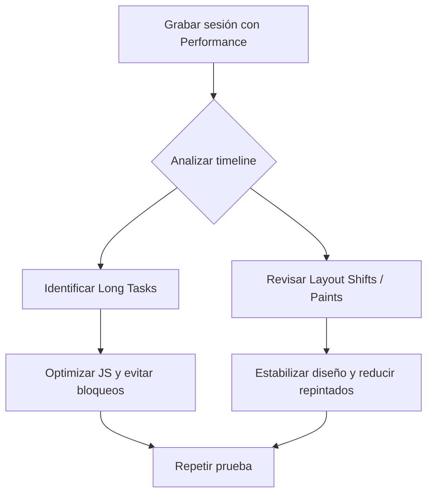

# Identificar cuellos de botella

Detectar y eliminar cuellos de botella es clave para garantizar un sitio rápido, fluido y eficiente, especialmente en dispositivos móviles o redes lentas. DevTools ofrece varias herramientas para auditar el rendimiento en detalle.

---

## 🧪 1. Auditoría inicial: grabación del rendimiento

Desde el panel **Performance**:

1. Presiona ⏺️ para iniciar la grabación.
2. Realiza acciones críticas (scroll, navegación, clics).
3. Detén la grabación y analiza:

### 🔍 Qué buscar:

| Indicador                    | Qué es                                                        | Problema común                                             | Solución                                              |
|------------------------------|---------------------------------------------------------------|------------------------------------------------------------|-------------------------------------------------------|
| **Long Tasks**               | Funciones que tardan >50 ms y bloquean el hilo principal        | JS no optimizado, bucles innecesarios, cálculos costosos     | Fragmentar tareas, usar `requestIdleCallback`         |
| **Layout Shifts**            | Cambios inesperados del contenido durante la carga              | Falta de dimensiones en imágenes, fuentes lentas             | Usa `width` y `height` en ``, `font-display: swap` |
| **Paint/Composite costosos** | Muchas repintadas o capas complejas                           | Animaciones mal optimizadas, sombras pesadas                 | Usa `will-change`, evita animar `top/left`              |

---

## 🧰 2. Herramientas clave del ecosistema DevTools

### ✅ Coverage Panel

- **Ruta:** `DevTools > Coverage`
- Muestra el porcentaje de CSS/JS no utilizado.
- Útil para eliminar dependencias innecesarias o dividir código.

```js
// Cargar cobertura desde consola
(async () => {
  await coverage.startCSSCoverage();
  await coverage.startJSCoverage();
})();
```

### 🧩 Layers Panel

- **Ruta:** `DevTools > More Tools > Layers`
- Visualiza cómo el navegador divide elementos en capas.
- Ideal para depurar transformaciones 3D, z-index y efectos de composición.

### 🎨 Paint Flashing

- **Ruta:** `DevTools > Rendering > Paint Flashing`
- Parpadea cada vez que un área del sitio se repinta.
- Proporciona un diagnóstico visual de zonas “inestables” o que se redibujan frecuentemente.

### 🐢 3. Throttling (limitación intencional)

Simula condiciones adversas para detectar problemas ocultos:

| Tipo                | Dónde aplicarlo                                  | Ejemplo de uso                              |
|---------------------|--------------------------------------------------|---------------------------------------------|
| **CPU Throttling**  | Performance panel > Config (⚙️) > CPU slowdown    | Simula móviles de gama baja (x4/x6)         |
| **Network Throttling** | Network panel > Throttle                        | Slow 3G, Offline, Mid-tier Mobile           |
| **FPS Meter**       | Rendering panel > Show FPS meter                 | Ver si caes por debajo de 60 FPS            |

---

## 📊 Diagrama de flujo de análisis



---

## ⏱️ Medición manual con `console.time()`

```js
console.time('renderLoop');
// Código que deseas medir
for (let i = 0; i < 100000; i++) {
  Math.sqrt(i);
}
console.timeEnd('renderLoop');
```

> **🧠 Útil para medir funciones críticas, loops o delays perceptibles por el usuario.**

---

## 🧯 Consejos prácticos

| Problema                  | Solución rápida                                               |
|---------------------------|---------------------------------------------------------------|
| Lags al hacer scroll      | Usa `transform: translate` en lugar de `top` o `left`         |
| Animaciones lentas        | Emplea `will-change: transform;` para preparar la capa          |
| Carga lenta en red móvil  | Aplica lazy-loading y reduce las requests iniciales            |
| Fugas de memoria          | Utiliza Performance > Record Heap Snapshot                     |

---

## 📌 Resumen: ciclo de mejora

- Graba una sesión completa en **Performance**.
- Detecta tareas largas y layout shifts.
- Analiza capas, uso de CPU y cobertura.
- Corrige el código.
- Vuelve a medir para validar mejoras.

---

## 🧠 Tip final

Si trabajas en una SPA (Single Page Application), cada interacción debe tratarse como una “micro navegación”. Es vital grabar eventos de usuario, como clics en componentes o cambios de vista, prestando especial atención al thread principal.