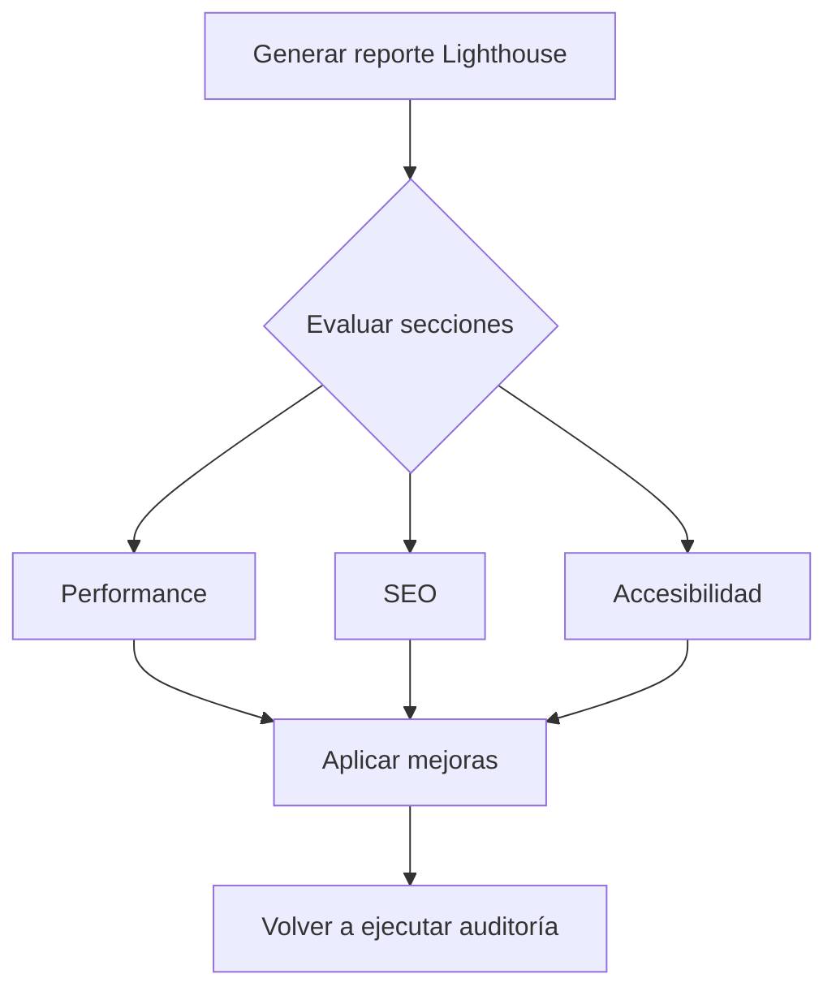

# Uso del panel Lighthouse

**Lighthouse** es una herramienta integrada en Chrome DevTools que permite auditar automáticamente el rendimiento, accesibilidad, buenas prácticas, SEO y experiencia en aplicaciones web (PWA).

---

## 🔧 Generar un reporte paso a paso

1. **Abrir DevTools** (`F12` o `Ctrl + Shift + I`) y dirigirse a la pestaña **Lighthouse**.
2. **Seleccionar las categorías** de auditoría:
   - ✅ **Performance**
   - ✅ **Accessibility**
   - ✅ **Best Practices**
   - ✅ **SEO**
   - ✅ **Progressive Web App** (opcional)
3. **Elegir el dispositivo de prueba**:
   - 📱 **Mobile**: Simula condiciones reales (CPU ralentizada, red 3G).
   - 🖥️ **Desktop**: Sin restricciones de CPU/red.
4. Presiona `Generate report`.

> **💡 Tip:** Cierra otras pestañas y extensiones para evitar interferencias en los resultados.

---

## 📊 Métricas clave del reporte

| Métrica                             | Qué mide                                              | Valor ideal  |
|-------------------------------------|-------------------------------------------------------|--------------|
| **FCP (First Contentful Paint)**    | Tiempo hasta que aparece el primer texto/imágenes      | < 1.8 s      |
| **LCP (Largest Contentful Paint)**  | Tiempo hasta que el contenido principal es visible    | < 2.5 s      |
| **TTI (Time to Interactive)**       | Tiempo hasta que la página responde completamente      | < 3.8 s      |
| **TBT (Total Blocking Time)**       | Tiempo total bloqueado por JS durante carga            | < 200 ms     |
| **CLS (Cumulative Layout Shift)**   | Cambios visuales inesperados al cargar                | < 0.1        |

> **🔍 Consejo:** Pasa el mouse sobre cada métrica en el reporte para ver sugerencias específicas.

---

## 🛠️ Acciones recomendadas según resultados

| Problema común                    | Recomendación                                           |
|-----------------------------------|---------------------------------------------------------|
| **Recursos bloqueantes (CSS/JS)** | Usa `async`, `defer` o divide los scripts                |
| **Archivos grandes sin compresión** | Activa Gzip o Brotli en el servidor                     |
| **Imágenes pesadas**              | Emplea formatos modernos (WebP/AVIF) y `loading="lazy"`  |
| **Fonts externas lentas**         | Preload de fuentes o utiliza `font-display: swap`        |
| **Código innecesario**            | Realiza limpieza con herramientas como PurgeCSS          |

---

## 🧪 Uso desde la línea de comandos (CLI)

Ideal para CI/CD, auditorías automatizadas o pruebas periódicas.

### 🔧 Instalación

```bash
npm install -g lighthouse
```

### ▶️ Ejecutar análisis

```bash
lighthouse https://example.com --view --preset=desktop
```

### 📂 Otras opciones útiles:

| Comando                             | Descripción                                        |
|-------------------------------------|----------------------------------------------------|
| `--preset=mobile`                   | Simula navegación móvil                            |
| `--output=json,html`                | Genera el reporte en múltiples formatos            |
| `--output-path=./reporte.html`      | Define la ruta de salida                           |
| `--throttling-method=provided`      | Usa red/CPU reales (sin simular)                  |

---

## 📁 Exportar y comparar reportes

Después de generar el reporte:

- 📄 **Exportar como HTML:** Botón **Export**.
- 📊 **Exportar como JSON:** Útil para comparación programática.
- 🔁 **Uso con Lighthouse CI:** Permite comparar versiones de la app y hacer regresiones de rendimiento.

---

## 📌 Flujo de auditoría recomendado



---

## 🎯 Tips extra para optimizar Lighthouse Score

- Desactiva extensiones antes de auditar.
- Usa navegación en incógnito para evitar cache/sesiones.
- Ejecuta auditoría en hosting real (mejor que localhost).
- Elimina elementos animados o vídeos auto-reproducidos si no son críticos.

---

## 📘 Conclusión

Lighthouse no solo te ayuda a medir el rendimiento, sino a descubrir oportunidades de mejora para ofrecer una experiencia rápida, accesible y optimizada para buscadores y usuarios.

> **📊 Tip final:** Usa herramientas como **PageSpeed Insights** o **WebPageTest** junto con Lighthouse para obtener una vista más completa del rendimiento desde distintas ubicaciones geográficas.